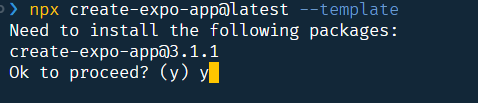
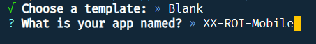

# Create Expo application

## Create react-native application using:

```bash
npx create-expo-app@latest --template
```

## You maybe asked to download new version of **expo**



## Use **Blank** template [`--template`]


> Name your project "**XX-ROI-Mobile**" XX is your initials



## Install Additional Packages

```bash
npx expo install `
@expo/vector-icons `
react-native-paper `
@react-native-async-storage/async-storage `
react-native-paper-dropdown `
react-native-safe-area-context `
react-native-web `
react-dom `
@expo/metro-runtime `
@react-navigation/native@^6.1.18 `
@react-navigation/bottom-tabs@^6.6.1 `
@react-navigation/stack@^6.4.1 `
react-native-screens
```

## Install `concurrently` package to help run the api with the mobile app

```bash
npm install concurrently --save-dev
```
