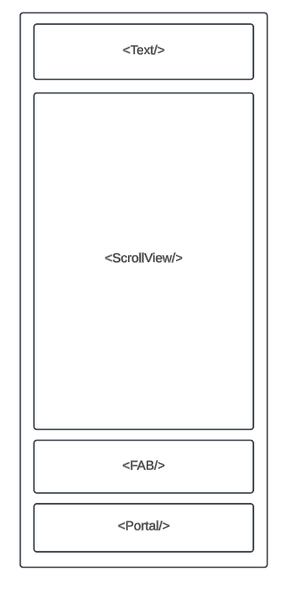
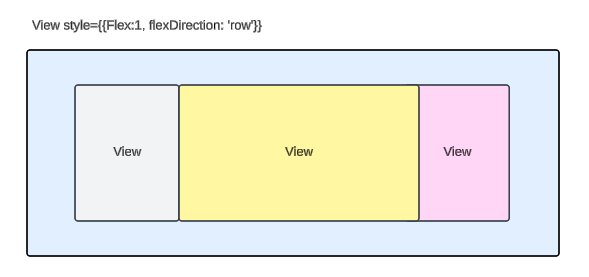
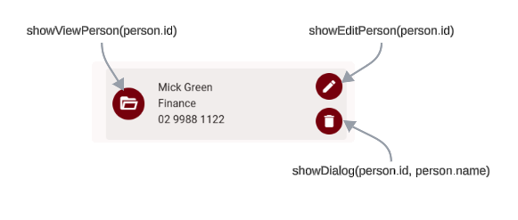
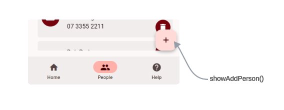
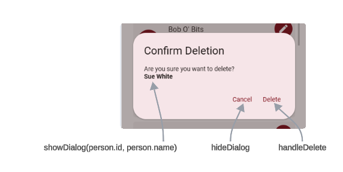

# Implement UI

## 1. In PeopleViewScreen

### 1.1 Preparation

- Import `useTheme` from `react-native-paper`, and grab the theme variable in the `PeopleViewScreen` component
  - `theme = useTheme();`
- Import `useIsFocused` from `@react-navigation/native`,
  - grab `const isFocused = useIsFocused();`
  - use it in the `useEffect` dependencies.

```javascript
useEffect(() => {
  fetchData();
}, [isFocused]);
```

- Data and functions elements used in the screen

| Element                              | Type     | Purpose                                                                   |
| ------------------------------------ | -------- | ------------------------------------------------------------------------- |
| `person.name`                        | content  | in the card content                                                       |
| `person.Department.name`             | content  | in the card content                                                       |
| `person.phone`                       | content  | in the card content                                                       |
| `showViewPerson(person.id)`          | function | uses it with the avatar to show the view screen                           |
| `showEditPerson(person.id)`          | function | use it in card, icon button to show edit of the current record            |
| `showDialog(person.id, person.name)` | function | use it in card, icon button to show dialog with person name before delete |
| `showAddPerson()`                    | function | use it in FAB to show the add new screen                                  |
| `hideDialog`                         | function | use it in Portal Dialog                                                   |
| `handleDelete`                       | function | use it in Portal Dialog                                                   |

### 1.2 Screen' Design

- Erase all staff from the return JSX except the root `<Surface/>` or `<View/>`
- Make sure the root Surface of View has `style={{ flex: 1, padding: 16 }}`
- Add `<Text/>` component as headline with text like `Staff Directory` styled `variant="headlineLarge"`
- Add `<ScrollView/>` component with `style={{ flex: 1 }}`
- Implement the card as shown alter
- Implement `<FAB/>` after `<ScrollView/>`
- Implement `<Portal>` after `<FAB/>`



### 1.3 Implement the Card

- Map the people array to a card of the following design:



- First View for the **avatar**, second for **main content**, and last on the right for the **buttons** as following:



- Use `TouchableOpacity` with `Avatar.Icon` component to create the avatar icon that will serve to open the view screen using the previously created function `showViewPerson(person.id)`
- Map 3 `Text` components to 3 field of the main content
- Create 2 `IconButton` components, aligned vertically and mapped to functions `showEditPerson(person.id)` and `showDialog(person.id, person.name)`

### 1.4 Implement the FAB



- A **floating action button** represents the primary action on a screen
- Link the `<FAB/>` to `showAddPerson()` previously created function that navigate to new screen
- Add the `<FAB/>` after the `<ScrollView/>`

### 1.5 Implement the Delete Dialog



- Refer to [Portal](https://callstack.github.io/react-native-paper/docs/components/Portal/) and [Dialog](https://callstack.github.io/react-native-paper/docs/components/Dialog/) from react native paper UI library
- Add the `<Portal>` after the FAB code
- `<Portal>` includes a `<Dialog/>` component that includes `<Dialog.Title>` and `<Dialog.Content>`, and `<Dialog.Actions>` that incudes 2 buttons, one for **Cancel** and the other for **Delete**
- Link the protal buttons as following:
  - Cancel to `hideDialog`
  - Delete to `handleDelete`

```jsx
<Portal>
  <Dialog visible={visible} onDismiss={hideDialog}>
    <Dialog.Title>Confirm Deletion</Dialog.Title>
    <Dialog.Content>
      <Text style={{ marginBottom: 10 }}>Are you sure you want to delete?</Text>
      <Text style={{ fontWeight: "bold" }}>{selectedPersonName}</Text>
    </Dialog.Content>
    <Dialog.Actions>
      <Button onPress={hideDialog}>Cancel</Button>
      <Button onPress={handleDelete}>Delete</Button>
    </Dialog.Actions>
  </Dialog>
</Portal>
```

## 2. In PersonViewScreen

## 3. In PersonEditScreen

## Snippets

| **Prefix**       | **Name**           | **Description**                                                                         |
| ---------------- | ------------------ | --------------------------------------------------------------------------------------- |
| jh-headline-text | Headline Text      | Creates a text element using React Native Paper with headline large styling.            |
| jh-map           | map                | Iterates through an array and renders elements for each item.                           |
| jh-c3p           | Card 3 pans        | Creates a card layout with three sections for avatar, main content, and action buttons. |
| jh-avatar        | Avatar             | Creates an avatar icon using React Native Paper.                                        |
| jh-text          | Text               | Creates a text element using React Native Paper with variant styling.                   |
| jh-v2b           | Vertical 2 Buttons | Creates a layout with two buttons stacked vertically with icons and onPress handlers.   |
| jh-fab           | FAB Button         | Creates a floating action button with an icon and onPress handler.                      |
| jh-delete-dialog | Delete Dialog      | Displays a confirmation dialog before deleting data.                                    |
