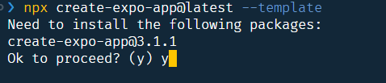
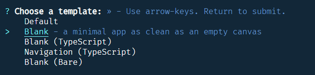
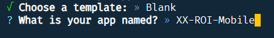
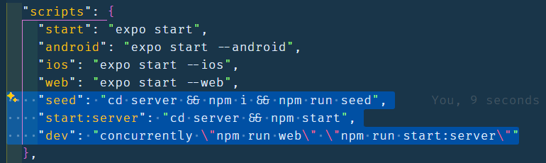
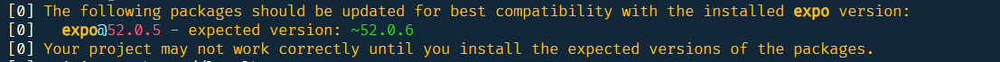
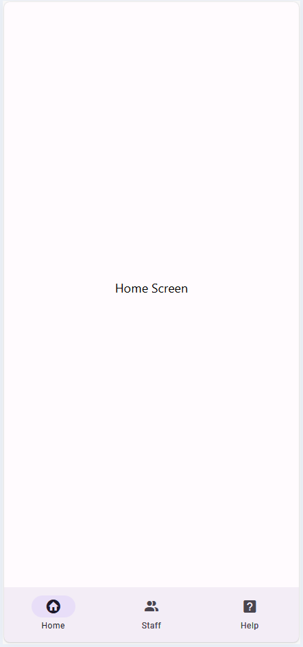

# SKY24 Project

## 1. Create Expo application

1.1 Create react-native application using [Expo](https://docs.expo.dev/get-started/create-a-project/)

```bash
npx create-expo-app@latest --template
```

1.2 You maybe asked to download new version of **expo**



1.3 Use **Blank** template [`--template`]



> Name your project "**XX-ROI-Mobile**" XX is your initials



1.4 Install Additional Packages

```bash
npx expo install `
@expo/vector-icons `
react-native-paper `
@react-native-async-storage/async-storage `
react-native-paper-dropdown `
react-native-safe-area-context `
react-native-web `
react-dom `
@expo/metro-runtime `
@react-navigation/native `
@react-navigation/bottom-tabs `
@react-navigation/stack `
react-native-screens
```

1.5 Install `concurrently` package to help run the api with the mobile app

```bash
npm install concurrently --save-dev
```

> Stage and commit "Add new dependencies for navigation and UI components"

## 2. Configure the server

1. Download [server](./assets/server.zip) zip file into the project folder
2. Extract it, so you should find a `server` folder into your project folder
3. This folder contain the api code to be used in your mobile app
4. Update `package.json` by adding the following lines to **scripts**

```json
    "seed": "cd server && npm i && npm run seed",
    "start:server": "cd server && npm start",
    "dev": "concurrently \"npm run web\" \"npm run start:server\""
```



5. Run `npm run seed` to install server' packages and seed the database
6. Run `npm run dev` to test your application, at this moment you have 2 running projects, the server and your app
7. You can use `roiapi.http` from the `server` folder to test the API
8. If encounter upgrade request to the expo SDK, please run the following command:

```bash
npm install expo@latest
```



## 3. Structure your App

3.1 File Naming

- **PascalCase** for screens, components, and navigators
- **lowercase** for folders
- Use **Screen** suffix for screens like `HomeScreen`
- Use **Navigator** suffix for navigators like `RootNavigator`

3.2 Create folders

```bash
|- components
|- navigation
|- screens
|- utils
```

3.3 Create 3 files for your navigators, `Root`, `Main`, `People` (or any name you like `Staff`, `Employees`)

3.4 Create Screens file in screens folder for `Home`, `Help`, `Not found`, `New & Edit`, `View`, and `List` records (6 screens)

3.5 Create file `api.js` in the `utils` folder for fetching data from the server

> Stage and commit "Initialize server with navigators for managing people and departments"

## 4. Code Navigators

- First navigator to be injected in the `App.js` is the `RootNavigator`
- `NavigationContainer` component should surround `RootNavigator` when injected in the `App.js`
- `SafeAreaProvider` should be imported and surround `NavigationContainer`
- `MainNavigator` is first child in `RootNavigator`
- `PeopleNavigator` is the second child in `MainNavigator` where `HomeScreen` is the first, and `HelpScreen` is the last
- Import all required screens and navigators
- Icon name in small letter
- `component` value is the screen name
- `name` attribute is the ID of the screen that can be used in navigation
- Use `createMaterialBottomTabNavigator` instead of `createBottomTabNavigator`

> Stage and commit "Add screens and navigators with basic layout"

- Run the add `npm run dev`
- You should have the following screenshot



## 5. Code fetch functions in `utils/api.js` file

- in `api.js` file write code to call asynchronously the api using `fetch` method
  - `export async function fetchCategories()`
  - `export async function fetchProducts()`
  - `export async function fetchProductById(id)`
  - `export async function addProduct(productData)`
  - `export async function updateProduct(id, updatedData)`
  - `export async function deleteProduct(id)`

## 6. Retrieve the data in the Screens

- Use `useState` to store the retrieved data
- Use `useEffect` to retrieve the data by calling the api function from the `api.js`
- `Staff directory` screen should retrieve all records
- `View`, `Edit`, and `Update` screens should retrieve one record by `ID`
